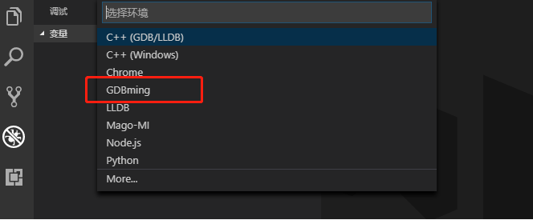
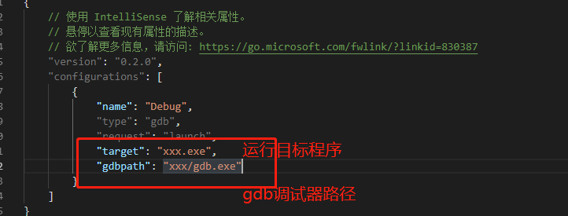

### 简述
本工程是一个vscode的gdb调试插件，也仅仅是一个调试插件，目前支持变量抓取、堆栈抓取以及断点设置、支持变量监视以及修改、不支持attach模式，没有printf的控制台输出内容。

### 使用
1、安装yarn 
2、安装依赖
> yarn install

3、打包成vscode插件
> yarn package

4、在vscode上安装后即可使用

### 运行配置

